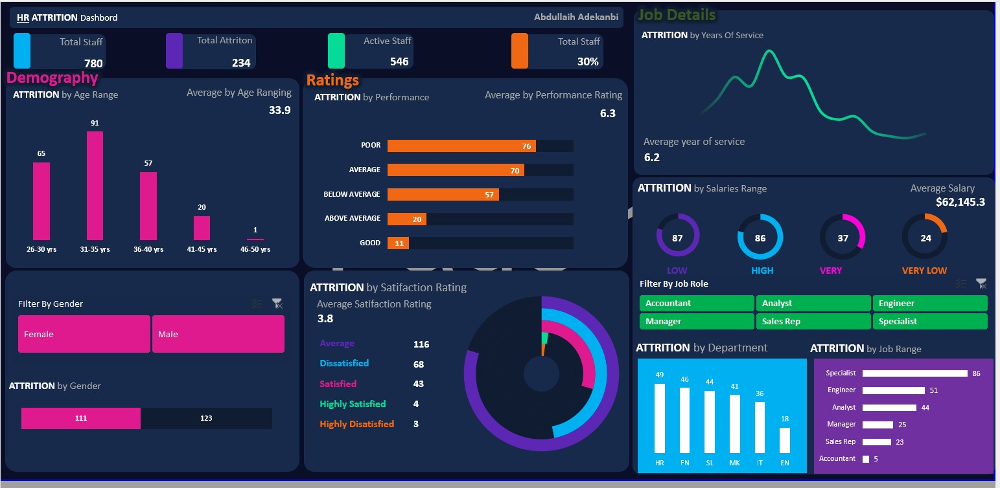
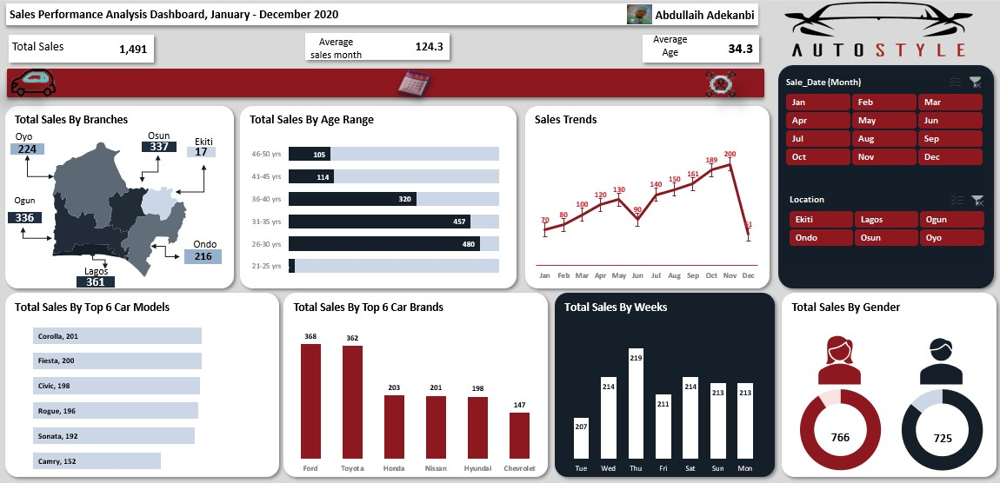
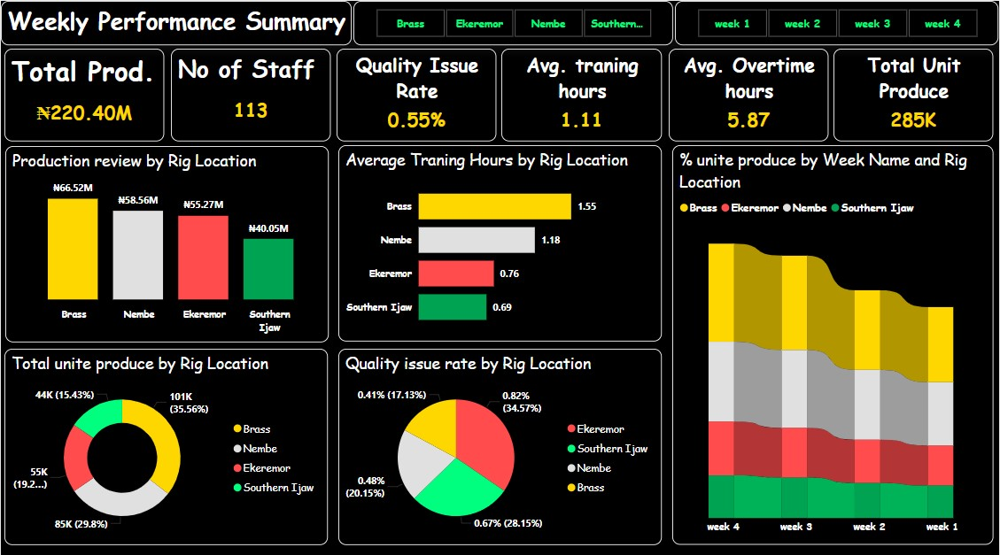
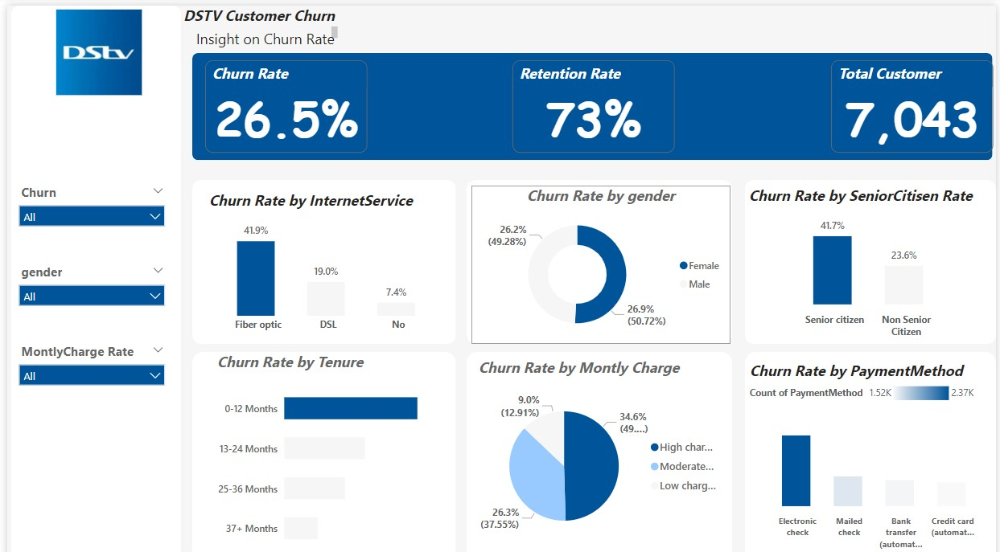

<!--Section 1: Introduce your self-->
## ABOUT ME

Hi There! I'm Abdullaih Adekanbi 🤓, As a detail-driven and analytical data analyst, I help organizations make informed decisions by extracting insights from complex data sets. With a strong foundation in statistical analysis, data visualization, and machine learning, I turn data into actionable recommendations that drive business growth.

<!--Mention your top/relevant skills here - core and soft skills-->
## WHAT I DO

*I provide consulting services for businesses and mentor aspiring analysts.*
*As a data analyst,my role involves collecting, organizing, and analyzing data to help organizations make informed business decisions. Here are some of the key tasks i perform;*

**- ✅ Data Analytics Consulting.**
1. *Data cleaning and preprocessing*: Ensuring data quality, handling missing values, and transforming data into a suitable format for analysis.
2. *Data visualization*: Creating reports, dashboards, and visualizations to communicate insights and trends to stakeholders.
3. *Statistical analysis*: Applying statistical techniques to identify correlations, trends, and patterns in data.. 

**- ✅ Data Interpretation.**
1. *Insight generation*: Interpreting data results, identifying key findings, and drawing meaningful conclusions.
2. *Recommendation development*: Developing actionable recommendations based on data insights to inform business decisions.
3. *Stakeholder communication*: Presenting findings and recommendations to both technical and non-technical stakeholders. 

**- ✅ Data Management.**
1. *Data governance*: Ensuring data quality, security, and compliance with organizational policies and regulations.
2. *Data storage and management*: Designing and implementing data storage solutions, managing data backups, and ensuring data accessibility.
3. *Data documentation*: Maintaining accurate and up-to-date documentation of data sources, processing, and analysis.

<!--Section 2: List 3-4 key projects-->
## MY PORTFOLIO 

*A glimpse of some of the projects I've been working on.*

**Predictive Modeling and Hypothesis Testing using <u>HR</u> ATTRITION Dataset.**

Discuss the importance of employee satisfaction and performance management.
[Read More](https://www.linkedin.com/posts/abdullaihadekanbi_dataanalysis-activity-7276018280027303936-11Gs)

**Predictive Modeling and Hypothesis Testing using Auto Sytle Dataset.**

How does your location impact sales performance in your industry?".
[Read More](https://www.linkedin.com/posts/abdullaihadekanbi_dataanalysis-activity-7271929182828261376-y73-?)

**Predictive Modeling and Hypothesis Testing using Weekly Performance  Dataset.**

Here are key insights derived from the "Weekly Performance Summary" dashboard 
[Read More](https://www.linkedin.com/posts/abdullaihadekanbi_dataanalysis-activity-7276032248385060864-qyoO?)

**Predictive Modeling and Hypothesis Testing using DSTV Dataset.**

How can flexible plans balance customer retention and satisfaction?".
[Read More](https://www.linkedin.com/posts/abdullaihadekanbi_churn-rate-analysis-dashboard-activity-7275555487251648513-pKL4?)

## CONTACT DETAILS

*Let’s connect and see how we can make a difference together!*
<table>
  <tbody>
    <tr>
      <td>📧</td>
      <td><a href="Abdullaihayomide@gmail.com">Abdullaihayomide@gmail.com</a></td>
    </tr>
    <tr>
      <td>📞</td>
      <td>(234) 701-168-7351</td>
    </tr>
    <tr>
      <td>📍</td>
      <td>Lagos, Nigeria</td>
    </tr>
    <tr>
      <td>⬇️</td>
      <td><a href="Assests/Profile.pdf">Download my CV</a></td>
    </tr>
    <tr>i
      <td>🌐</td>
      <td><a href="https://linkedin.com/in/abdullaihadekanbi">The things I do daily on LinkedIn</a></td>
    </tr>
  </tbody>
</table>
