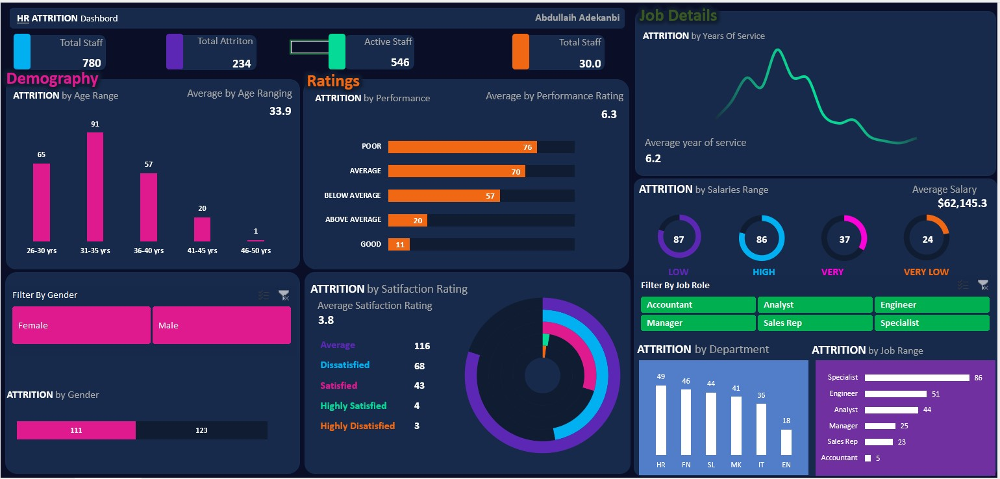

<!--Section 1: Introduce your self-->
## ABOUT ME

Hi There! I'm Abdullaih Adekanbi 🤓, As a detail-driven and analytical data analyst, I help organizations make informed decisions by extracting insights from complex data sets. With a strong foundation in statistical analysis, data visualization, and machine learning, I turn data into actionable recommendations that drive business growth.

<!--Mention your top/relevant skills here - core and soft skills-->
## WHAT I DO

*As an Analyst of Abdullaih Solutions Ltd, I provide consulting services for businesses and mentor aspiring analysts.*
*As a data analyst,my role involves collecting, organizing, and analyzing data to help organizations make informed business decisions. Here are some of the key tasks i perform;*

**- ✅ Data Analytics Consulting.**
1. *Data cleaning and preprocessing*: Ensuring data quality, handling missing values, and transforming data into a suitable format for analysis.
2. *Data visualization*: Creating reports, dashboards, and visualizations to communicate insights and trends to stakeholders.
3. *Statistical analysis*: Applying statistical techniques to identify correlations, trends, and patterns in data.. 

**- ✅ Data Interpretation.**
1. *Insight generation*: Interpreting data results, identifying key findings, and drawing meaningful conclusions.
2. *Recommendation development*: Developing actionable recommendations based on data insights to inform business decisions.
3. *Stakeholder communication*: Presenting findings and recommendations to both technical and non-technical stakeholders. 

**- ✅ Data Management.**
1. *Data governance*: Ensuring data quality, security, and compliance with organizational policies and regulations.
2. *Data storage and management*: Designing and implementing data storage solutions, managing data backups, and ensuring data accessibility.
3. *Data documentation*: Maintaining accurate and up-to-date documentation of data sources, processing, and analysis.

<!--Section 2: List 3-4 key projects-->
## MY PORTFOLIO 

*A glimpse of some of the projects I've been working on.*

**Predictive Modeling and Hypothesis Testing using Titanic Dataset.**

The sinking of the Titanic is one of the most infamous shipwrecks in history.

[Read More](Follow me on LinkedIn:
www.linkedin.com/comm/mynetwork/discovery-see-all?usecase=PEOPLE_FOLLOWS&followMember=abdullaih-adekanbi-424b0b33b)

**Predictive Modeling and Hypothesis Testing using Titanic Dataset.**

On April 15, 1912, during her maiden voyage, the widely considered “unsinkable” RMS Titanic sank after colliding with an iceberg. 

[Read More](Follow me on LinkedIn:
www.linkedin.com/comm/mynetwork/discovery-see-all?usecase=PEOPLE_FOLLOWS&followMember=abdullaih-adekanbi-424b0b33b)

**Predictive Modeling and Hypothesis Testing using Titanic Dataset.**

Unfortunately, there weren’t enough lifeboats for everyone onboard, resulting in the death of 1502 out of 2224 passengers and crew. 

[Read More](https://www.linkedin.com/pulse/predictive-modeling-hypothesis-testing-using-titanic-dataset-anietie/)

## MY CLASSES

*Call my admin for details about the classes: 08034730987.*

- Settings | One-on-One, Group, Communities.								       		
- Platforms	| Physical or Virtual, Weekday or Weekend. 			        		
- Courses | Advanced Excel, Statistics, Power BI, SQL, Tableau, Python.

<!--Section 3: This section is optional. You can replace this section with a list of your core skills-->
## MY COURSES
*You can get these courses today.*

**Performance Analysis**

Advanced Data Analytics: Mastering the Craft with Portfolio Project using Excel. Master data analytics by solving real-world sales problems using MS Excel 2021, learn core dashboard design and presentation skills and create your portfolio project. This course is designed for beginners and professional data analyst.

[Get this course](https://selar.co/salesdata)

**Attrition Analysis**

In this course, you will learn how to analyze HR and employee data, including demographics, job roles, performance metrics, and workplace satisfaction, to identify the underlying causes and predictors of employee attrition.

[Get this course](https://selar.co/q688i7)

## CONTACT DETAILS

*Let’s connect and see how we can make a difference together!*
<table>
  <tbody>
    <tr>
      <td>📧</td>
      <td><a href="mailto:anietieetuk@gmail.com">anietieetuk@gmail.com</a></td>
    </tr>
    <tr>
      <td>📞</td>
      <td>(234) 816-763-7212</td>
    </tr>
    <tr>
      <td>📍</td>
      <td>PH, Nigeria</td>
    </tr>
    <tr>
      <td>⬇️</td>
      <td><a href="https://etuk123456.github.io/portfolio1/docs/Profile.pdf">Download my CV</a></td>
    </tr>
    <tr>
      <td>🌐</td>
      <td><a href="https://linkedin.com/in/etukanietie">The things I do daily on LinkedIn</a></td>
    </tr>
    <tr>
      <td>📺</td>
      <td><a href="https://www.youtube.com/@LearnwithEtuk">Watch my tutorials on YouTube</a></td>
    </tr>
  </tbody>
</table>
